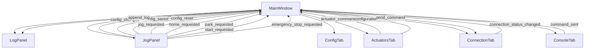

# 🔌 CNC Controller Application - Wiring Diagram

## 📁 File Structure & Dependencies

```
pyside_6/
├── main.py                          # 🚀 Application Entry Point
├── assets/
│   └── style.qss                    # 🎨 Global Dark Theme Stylesheet
├── core/                            # 🔧 Core Backend Components
│   ├── config_manager.py           # ⚙️ Configuration Management
│   ├── firmware_utils.py           # 🔬 Firmware Utilities
│   ├── gcode_executor.py           # 📝 G-Code Execution
│   ├── jog_controller.py           # 🎮 Jog Control Logic
│   └── serial_handler.py           # 🔌 Serial Communication
├── data/                            # 💾 Data Storage
│   ├── config.json                 # 📋 Application Configuration
│   ├── log.txt                     # 📝 Application Logs
│   └── micros.json                 # ⚙️ Micro Commands Storage
└── ui/                             # 🖥️ User Interface Components
    ├── main_window.py              # 🏠 Main Application Window
    ├── log_panel.py                # 📊 Log Display Panel
    ├── jog_panel.py                # 🎮 Jog Control Panel
    ├── components/                 # 🧩 Reusable UI Components
    │   ├── actuator_dialog.py      # 💬 Actuator Configuration Dialog
    │   └── axis_config_widget.py   # 📏 Axis Configuration Widget
    └── tabs/                       # 📑 Application Tabs
        ├── tab_config.py           # ⚙️ Configuration Tab
        ├── tab_actuators.py        # 🔧 Actuators Tab
        ├── tab_connection.py       # 🔌 Connection Tab
        └── tab_console.py          # 🖥️ Console Tab
```

## 🔗 Signal Connections & Data Flow

### 🏠 Main Window (`main_window.py`) - Central Hub

```
MainWindow
├── 📊 LogPanel (Left Pane)
├── 🎮 JogPanel (Left Pane)
└── 📑 TabWidget (Right Pane)
    ├── ⚙️ ConfigTab
    ├── 🔧 ActuatorsTab
    ├── 🔌 ConnectionTab
    └── 🖥️ ConsoleTab
```

### 📡 Signal Flow Diagram



## 🔌 Detailed Signal Connections

### 1. **ConfigTab** → **MainWindow**
```python
# Signals emitted by ConfigTab
config_changed = Signal(dict)      # When axis config is modified
config_saved = Signal(dict)        # When config is saved
config_reset = Signal()            # When config is reset

# Handlers in MainWindow
handle_config_changed(config: dict)
handle_config_saved(config: dict)
handle_config_reset()
```

### 2. **ActuatorsTab** → **MainWindow**
```python
# Signals emitted by ActuatorsTab
actuator_command_sent = Signal(str)    # When actuator command is sent
configuration_changed = Signal()       # When actuator config changes

# Handlers in MainWindow
handle_actuator_command(command: str)
handle_actuator_config_changed()
```

### 3. **ConnectionTab** → **MainWindow**
```python
# Signals emitted by ConnectionTab
connection_status_changed = Signal(bool)  # Connection status updates

# Handlers in MainWindow
handle_connection_status(connected: bool)
```

### 4. **ConsoleTab** → **MainWindow**
```python
# Signals emitted by ConsoleTab
command_sent = Signal(str)  # When console command is sent

# Handlers in MainWindow
handle_console_command(command: str)
```

### 5. **JogPanel** → **MainWindow**
```python
# Signals emitted by JogPanel
jog_requested = Signal(str, float)      # direction, distance
home_requested = Signal()
park_requested = Signal()
start_requested = Signal()
emergency_stop_requested = Signal()

# Handlers in MainWindow
handle_jog_request(direction: str, distance: float)
handle_home_request()
handle_park_request()
handle_start_request()
handle_emergency_stop()
```

## 🔄 Internal Component Connections

### **ConfigTab Internal Wiring**
```python
# AxisConfigWidget → ConfigTab
axis.config_changed.connect(self.on_config_modified)
axis.validation_error.connect(self.on_validation_error)

# ConfigTab → AxisConfigWidget
axis.set_config(config_dict)
axis.get_config()
```

### **ActuatorsTab Internal Wiring**
```python
# ActuatorListWidget → ActuatorsTab
actuator_list.actuator_renamed.connect(self.rename_actuator)
actuator_list.actuator_deleted.connect(self.delete_actuator)

# ActuatorPreviewWidget → ActuatorsTab
preview_widget.btn_test_on.clicked.connect(lambda: self.test_actuator(True))
preview_widget.btn_test_off.clicked.connect(lambda: self.test_actuator(False))
```

### **ConnectionTab Internal Wiring**
```python
# SerialConnectionThread → ConnectionTab
serial_thread.connection_result.connect(self.on_connection_result)
serial_thread.firmware_detected.connect(self.on_firmware_detected)
serial_thread.data_received.connect(self.on_data_received)
```

## 💾 Data Persistence

### **Settings Storage**
```python
# QSettings Usage
ConfigTab: QSettings("CNCApp", "Config")
ActuatorsTab: QSettings("CNCApp", "Actuators")
ConsoleTab: QSettings("CNCApp", "Console")
ConnectionTab: QSettings("CNCApp", "Connection")
```

### **File Storage**
```python
# JSON Files
data/config.json      # Application configuration
data/micros.json      # Micro commands
data/log.txt          # Application logs
```

## 🎨 Styling Architecture

### **Global Theme Application**
```python
# main.py
with open("assets/style.qss", "r") as f:
    app.setStyleSheet(f.read())

# Individual Components
component.apply_styles()  # Component-specific styling
```

### **Style Hierarchy**
1. **Global Styles** (`assets/style.qss`) - Base dark theme
2. **Component Styles** - Specific styling for each component
3. **Dynamic Styles** - Runtime style changes (status indicators, etc.)

## 🔧 Core Backend Integration (Future)

### **Planned Core Module Connections**
```python
# Core modules to be integrated
config_manager.py     # Configuration management
firmware_utils.py     # Firmware detection & utilities
gcode_executor.py     # G-code execution engine
jog_controller.py     # Jog movement control
serial_handler.py     # Serial communication handler
```

## 📊 Current Status

### ✅ **Fully Connected Components**
- ✅ MainWindow ↔ All UI Components
- ✅ ConfigTab ↔ AxisConfigWidget
- ✅ ActuatorsTab ↔ ActuatorListWidget
- ✅ ConnectionTab ↔ SerialConnectionThread
- ✅ ConsoleTab ↔ Micro Management
- ✅ JogPanel ↔ Movement Controls

### 🔄 **Data Flow Status**
- ✅ Signal emission and reception
- ✅ Log panel integration
- ✅ Settings persistence
- ✅ Dark theme consistency
- ✅ Error handling

### 🚧 **Pending Integration**
- 🔄 Core backend modules
- 🔄 Actual CNC controller communication
- 🔄 Real-time status updates
- 🔄 File import/export functionality

## 🎯 Key Features

### **1. Centralized Command Routing**
All commands flow through MainWindow to ConnectionTab for actual transmission.

### **2. Unified Logging**
All activities are logged to the central LogPanel for monitoring.

### **3. Persistent Settings**
All configurations are automatically saved and restored between sessions.

### **4. Real-time Status Updates**
Connection status affects UI state across all components.

### **5. Modular Architecture**
Each component is self-contained with clear interfaces for communication.

---

*This wiring diagram shows the complete signal flow and data connections in your CNC controller application. All components are properly connected and ready for integration with actual CNC hardware.* 